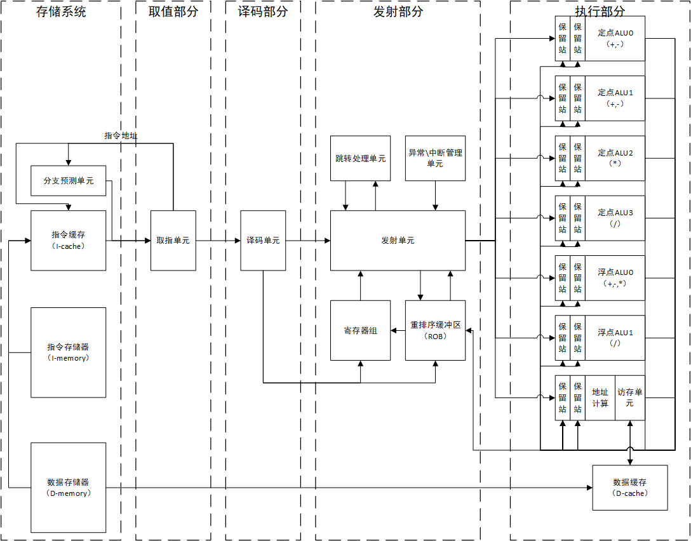
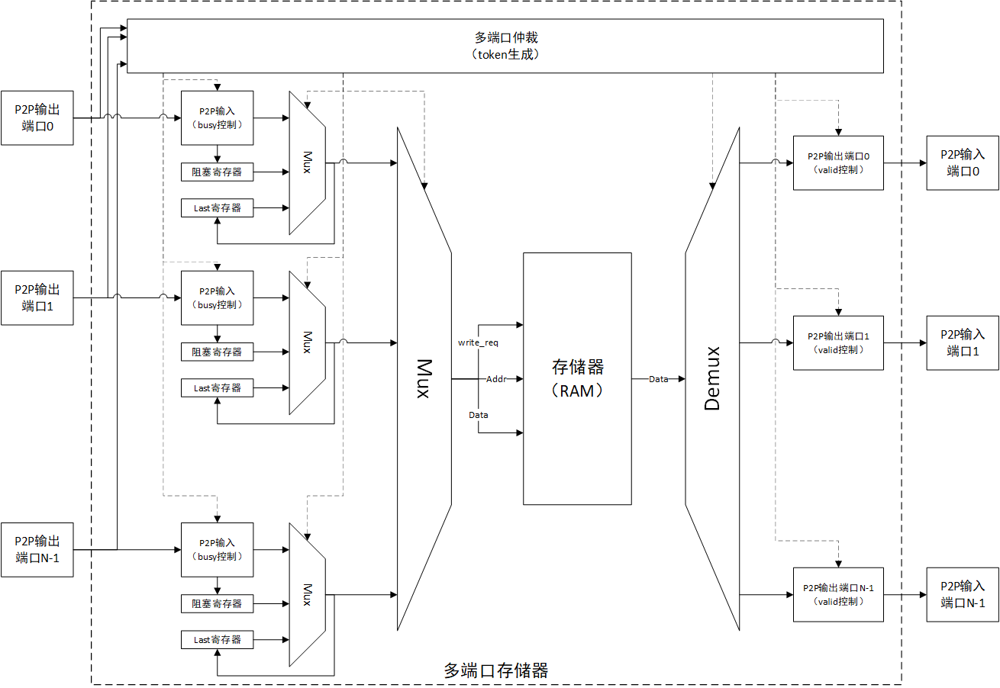
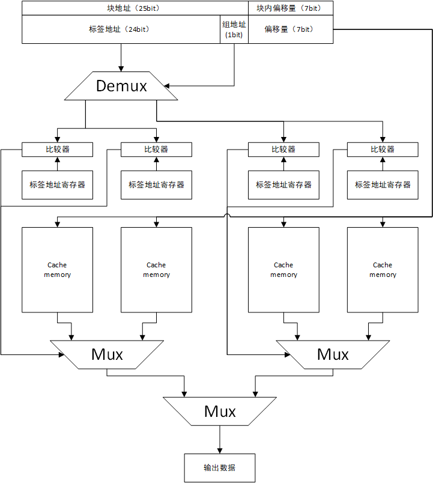
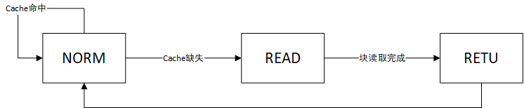
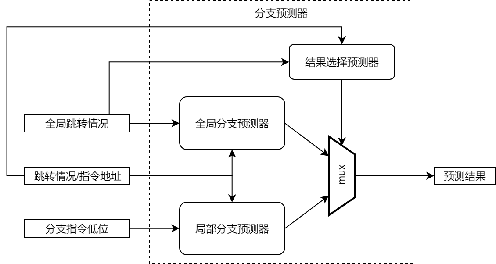
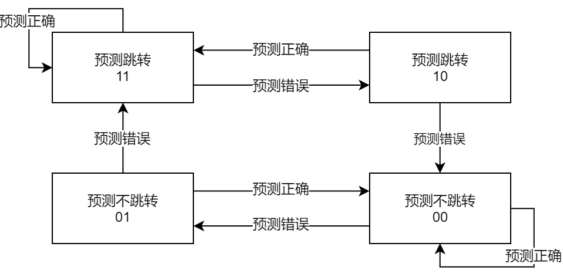
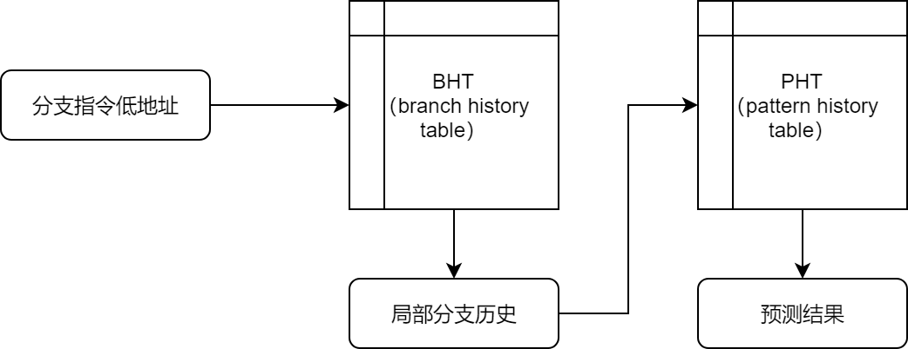
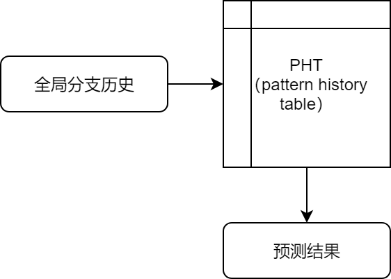

# 目录

[TOC]

# 1.设计目标

设计一款CPU核心，实现RISC-V指令集中的RV32I、RV32C和RV32F指令集，要求应用：

- 动态分支预测技术
- 乱序执行技术（使用ROB实现）
- 数据cache技术

# 2.系统架构

RISC-Tai整体分为5个部分：

- 存储系统：包括分离的指令寄存器和数据寄存器，其中超出指令存储器能力的指令可以保存在数据存储器中，但数据不可保存在指令寄存器中。同时指令缓存和分支预测单元（视为一种特殊的存储）也被包括在存储系统中
- 取值部分：可支持32位指令和16位指令混合取值，理想情况下每个时钟周期可取一条指令，通过P2P端口发送到下一级译码部分中。同时会简单的判断是否为分支指令，使用分支预测的结果进行预测跳转
- 译码部分：对指令进行译码，通过P2P接口向下一级提供操作数寄存器地址、操作类型、操作目的寄存器地址和立即数操作数
- 发射部分：使用P2P端口向下一级发送指令和操作数。寄存器组位于这一部分，同时负责乱序执行的ROB、中断和异常管理单元与分支跳转判断均位于这一部分。
- 执行部分：分为7条变长流水线，每一条流水线均具有两个保留站，同时访存单元视为该部分的组件，数据缓存也包括在这一部分。

# 3.子模块架构

## 3.1.存储系统

存储子系统分为以下几个部分：

- 指令存储器（I-memory）：位宽为64bit，深度为1024Word，共$8B \times 1024 = 8KB$的单口RAM，具有两个不可同时工作的写和读端口，分别负责程度烧录和指令读出
- 数据存储器（D-memory）：位宽为32bit，深度为16384Word，共$4B \times 16384 = 64KB$的单口RAM，具有两个读端口和两个写端口，读端口分别为指令读取接口和数据读取接口，写端口分别为数据写入和程序烧录写入，四个端口不可同时访问。
- 指令缓存（I-cache）：一个具有4个块，每个块单位为128B的指令缓存，容量为$4 \times 128B = 512B$的指令缓存，使用两路组相联缓存。
- 分支预测器（branch prediction）：实现一个Tournament分支预测器，其中考虑全局跳转情况次数M为4，低位地址D为6。

### 3.1.1.多端口RAM

多端口RAM实现了I-memory和D-memory，尽管物理仅有一个读写端口，但其可以分时复用支持多个端口读写，其结构如下所示：

上图考虑了一个N输入M输出的多端口存储器，其中M为读端口数量，N-M为写端口数量。这里引入token的概念，即令牌，这是一个具有Nbit的标志位，每一时刻有且仅有一个bit为1，其他均为0：

- 当token的第i个bit为1时，表示第i个端口获得了令牌，即为当前提供服务的端口
- 当token的第i个bit为0时，表示当第i个端口无法提供访问服务。

对于每一个输入端口而言，对外需要控制busy的输出，对内需要控制阻塞标志位和阻塞数据寄存器，这三个部分的控制方法与标准p2p类似，但需要考虑token的介入，操作方法如下所示：

- busy信号：当对应的输出后级busy输入拉高时或一次输入发生但该端口未获得令牌时或阻塞标志拉高时拉高；其他情况拉低。
- 阻塞标志位：当一次输入发生但该端口未获得token或后级busy输入为高时拉高；当后级busy输入为低且该端口获得令牌时拉低；其他情况保持不变。
- 阻塞数据寄存器：与普通P2P类似，当一次输入发生但该端口未获得token或后级busy输入为高时将输入数据保存进阻塞数据寄存器中。

图中为了实现仲裁且数据不丢失额外添加了Mux和last寄存器，这两个部件的功能和操作方式如下所示：

- Mux：从输入数据、阻塞数据寄存器和last寄存器提供的数据中选择一个送到下一级mux。当一次输入发生但该端口未获得token或后级busy输入为高时选择last寄存器中的数据；当下一级busy拉低且该端口获得令牌且阻塞标志位拉高时选择阻塞数据寄存器中的数据；当下一级busy拉低且该端口获得令牌时选择P2P输入数据；其他情况保持上一次的选择，通过一个寄存器保存上一次的选择。
- last寄存器：由于该部分的核心输出为RAM，假设该RAM的输出为时序输出（通过寄存器输出），为了防止该模块输出为组合输出，故添加last寄存器在数据阻塞时保持输入不变而不是像普通P2P端口保持输出端口不变。寄存器为每次Mux输出数据的寄存器副本，即每个时钟周期last寄存器均会保存上一个周期mux的输出。

对于输出部分，需要控制的输出为P2P中的输出valid和输出数据部分，控制方式如下所示：

- 输出valid：寄存器输出，当某个P2P端口获得令牌且一次输入完成且输入的write_req为低时拉高；当一次输出完成后拉低。
- 输出数据：直接由存储器输出

### 3.1.2.指令cache

对于指令cache而言，主要考虑执行位于连续地址的指令，部分考虑指令跳转和返回可能产生的miss情况，因此采用较大的块和较少的块数：块大小为128B，可以容纳连续的32条32bit指令；块数4，为两路组相联。物理地址总范围为32bit，块大小为128B，即块内偏移地址7bit，块地址为25bit。由于有4个块使用2路组相联，即标签地址为24bit，数据读取部分如下所示：

通过P2P接口输入32bit的地址，32bit地址分为三个部分：

- 标签地址（24bit）：高24bit地址，用于与标签地址寄存器比较，判定缓存是否命中
- 组地址（1bit）：用于判定该地址会保存在哪一组中
- 偏移量（7bit）：访问目标地址的偏移量

进行读取时，首先从P2P接口输入32bit的地址信息（位宽为8B，因此最低3bit均为0），同时进行以下两个操作：

- 数据读取：通过组地址选择两个cache memory，随后根据偏移量读出两个数据待选择
- 命中判定：使用标签地址和被选中的两个cache memory进行比较，当且仅当一个cache memory对应的标签地址与有效信号均有效时判定cache命中拉高输出valid输出数据；否则cache未命中，从对应的存储器中读取指定长度的数据块填充cache memory，填充完成后再进行输出

为了实现上述功能，整个cache部分处于一个状态机的控制下，状态机转移图如下所示：

- NORM：复位后所在的位置，当cache不发生缺失时工作在NORM位置，此时cache memory的控制权在地址输入端口
- READ：读数据块状态，当cache发生缺失时进入该状态，从读地址口输出数据，并从输入数据口写入数据，此时cache memory在载入控制器的控制下
- RETU：返回状态，从读取数据块返回正常工作的过渡状态，cache memory的控制权从载入控制器交还给地址输入端口

### 3.1.3.分支预测单元（是否跳转预测）

分支预测单元分为两个部分，分别是是否跳转的预测和跳转地址的预测。这里是否分支预测使用了两级分支预测器，即全局分支预测器+局部分支预测器的方法，系统结构如下所示：

上图中共3个预测器，分别为全局分支预测器、局部分支预测器和结果选择预测器，功能如下所示：

- 全局分支预测器：根据该指令之前的若干次跳转指令的跳转情况预测是否跳转
- 局部分支预测器：根据具有相同低地址的跳转指令的跳转情况预测是否跳转
- 结果选择预测器：根据该指令之前的若干次跳转指令的跳转情况选择使用哪一个分支预测器的结果

上述的每个预测器均使用2bit分支预测器，即根据之前的两次跳转情况预测是否跳转，2bit分支预测器的状态跳转图如下所示：

<<<<<<< HEAD
现在考虑局部分支预测器，首先考虑预测部分，局部分支预测器以跳转指令的低位地址为索引，按索引找到对应的分支预测器（对应的2bit状态位），输出状态位的高位（观察发现状态位高位即为预测结果）。随后考虑更新部分，当后续产生某个跳转指令的判断结果，将地址低位和结果输入局部分支预测器更新接口中，根据地址低位找到对应的分支预测状态，按上述状态跳转进行更新。

对于全局分支预测器，用于查找对应分支预测器的方法是全局跳转模式，即指定次最近跳转的情况。因此需要在内部维护一个跳转模式的移位寄存器，用于

=======
首先考虑局部分支预测器，局部分支预测器分为两个部分，分别是BHT（branch history table）和PHT（pattern history table），BHT使用跳转指令的低地址索引，根据低地址索引查找对应的最近跳转模式，即最近M个相同的低地址跳转指令的跳转情况，随后根据Mbit的跳转情况在PHT中查找对应的2bit分支预测器，给出预测结果，其结构如下图所示：

当后级流水线完成跳转指令的计算时，需要更新该局部分支预测器，更新的过程为将分支指令地址、实际跳转情况和预测跳转情况传回，更新不考虑连续跳转预测情况，即已预测但实际运算的跳转指令不计入分支历史中。更新分为更新BHT和PHT两个并行的步骤：

- BHT：根据分支指令低地址查找到分支预测器，将跳转情况更新到对应的表项
- PHT：通过分支指令低地址查找到未更新的局部分支历史，再在PHT中找到对应的2bit分支预测器，根据预测结果和实际结果进行修改

随后考虑全局分支预测器，其结构与局部分支预测器相比改为所有分支指令共享一个BHT，即不需要根据分支指令地址查找分支局部历史，仅需要根据全局历史查找一个PHT即可，结构如下所示。其更新方式也仅需要更新PHT和全局分支历史记录，更新的方式与更新PHT相同。

最后为选择结果预测器也为全局分支预测器，其根据历史选择情况情况选择使用哪一个分支预测器的结果（本地分支预测器或全局历史分支预测器），其更新方式与历史分支预测器类似，当两个预测器的预测结果均正确或均错误时，认为选择分支预测器预测正确，当选择分支预测器选择的结果预测错误且另一个分支预测器预测正确时，认为选择分支预测器预测错误，使用2bit分支预测器的更新算法进行更新。同样的，已预测但实际运算的跳转指令不计入分支历史中。
>>>>>>> 57a6eb3e32a4a9c347f87c360ec53cdc4c534eda
